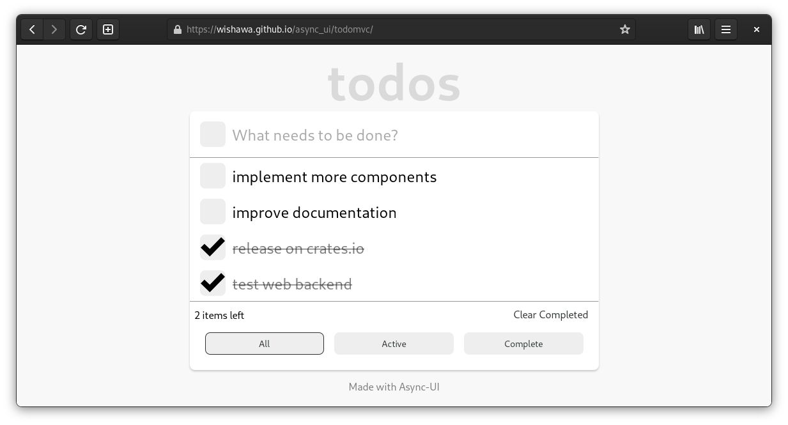
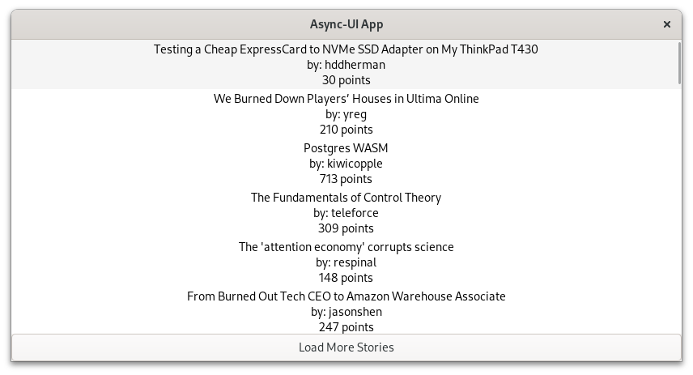

+++
title = "Async UI: a Rust UI Library where Everything is a Future"
description = "Lifetime-Friendly, Component-Based, Retained-Mode UI Powered by Async Rust"
date = 2022-10-04
[taxonomies]
categories = ["Tech"]
tags = ["Async UI", "Rust"]
+++

This blog post is intended for readers with some experiences in async Rust. It assumes you know what a [Future](https://doc.rust-lang.org/std/future/trait.Future.html) is!

## What is Async UI?

Async UI is a proof-of-concept Rust UI library with backend for the web (HTML/JS), and GTK 4. It is not ready for production use yet.

## Screenshots

Todo List Demo [(interactive version here)](https://wishawa.github.io/async_ui/todomvc)



GTK Hacker News Screenshot



## Why Async for UIs?

UI widgets are **retained**: they run some code, stay there and wait for some events (such as user interactions), and then run some more code to handle those events.

Sync Rust cannot handle the *stay there and wait for some events* step in a clean way. Widgets can live for arbitrarily long, and sync Rust lifetimes cannot express that.

Async Rust solves this problem: in async functions, lifetimes can span across await points, and await points may pause for however long we want. This allows us to express a widgets' lifetimes directly with Rust lifetimes. To do so, we represent components as async functions.

## Widgets are Futures

```rust
async fn hello_world() {
	text(&"Hello World!").await;
}
```

Here `text` is a built-in component provided by the library.
It is an async function. To render it you simply await it.
The `hello_world` function we just made is also a component. To render it, just `hello_world().await`.

## Easily Compose Components

Modern UI programming is all about *composition* — encapsulating many child components in a single parent component.
This is analogous to [joining](https://docs.rs/futures/latest/futures/future/fn.join.html) futures: you join many child futures together to get one future that runs all the children in parallel.


In Async UI, this joining is done with *fragments*. A `Fragment` is a future that contains multiple widgets. When you await the Fragment, all the widgets in it are rendered.

```rust
async fn hello_world_2() {
	// create a Fragment
	fragment((
		// use the component we previously made!
		hello_world(),
		// have a button beside it
		button(ButtonProps {
			children: fragment((
				text(&"Say hello back"),
			)),
			on_press: Some(
				&mut |_ev: PressEvent| {
					todo!();
				}
			),
			..Default::default()
		})
	)).await;
}
```

Here, we are rendering the "Hello World!" and a button next to it. Inside the button we have the text "Say hello back".

## Express Complex UI Flows

Components being async functions makes writing UI flows as easy as writing code flows.

With if/else, loop/break, and [race](https://docs.rs/futures-lite/latest/futures_lite/future/fn.race.html), you can describe complicated UI flows very intuitively.

```rust
async fn login_flow() {
	loop {
		let (username, password) = login_form().await;
		if check_login(username, password).await {
			// Login successful!
			break;
		}
		else {
			race(
				// Render the popup component.
				invalid_login_popup(),

				// Race with a future that will complete in 5 seconds.
				// In 5 seconds, this future will "win" the race and cause
				// the popup future to be dropped, unmounting the popup.
				wait_5_seconds()
			).await;
			// Loop back to the login form!
		}
	}
}
```

## Bring your own Reactivity

The core of Async UI doesn't know anything about reactivity.
It's just async Rust! You can use channels ([async-channel](https://crates.io/crates/async-channel) is a great crate).
You can use signals ([futures-signals](https://crates.io/crates/futures-signals) is a great crate).
You can use whatever works in async Rust.

The built-in components for both Web and GTK support reactivity through a simple interface provided by the `observables` crate. The crate provides basic reactivity with: `ReactiveCell<T>`.

```rust
async fn counter() {
	let mut count = 0;

	// Like a RefCell that you can subscribe to!
	let count_string = ReactiveCell::new(count.to_string());

	fragment((
		// When count_string changes, the text will change.
		text(&count_string.as_observable()),

		button(ButtonProps {
			children: fragment((
				text(&"+"),
			)),
			on_press: Some(&mut |_ev| {
				// Upon press, increment count and update the string accordingly.
				count += 1;
				*count_string.borrow_mut() = count.to_string();
			}),
			..Default::default()
		})
	)).await;
}
```

For advanced reactivity and state management, I'm not sure what model will fit best with Async UI yet, but I've been experimenting with [X-Bow](https://github.com/wishawa/async_ui/tree/main/x-bow).

## Take Advantage of the Async Ecosystem

Async UI is "just async Rust", so it is very easy to use together with Rust libraries.
Under the hood, it uses [async-executor](https://crates.io/crates/async-executor) from the smol team. This is **the executor used by async-std**, so anything that works on async-std should be compatible with Async UI. The GTK Hacker News demo you see above, for example, uses async-std's [surf](https://github.com/http-rs/surf) crate to fetch data.

## End Notes

Async UI is **still under development**. The core idea is complete, but lots of work remain to be done on the built-in components.

There's a lot more to explain about the workings of the library. I'll post more blog posts soon. Stay tuned!

[GitHub repo for Async UI](https://github.com/wishawa/async_ui)